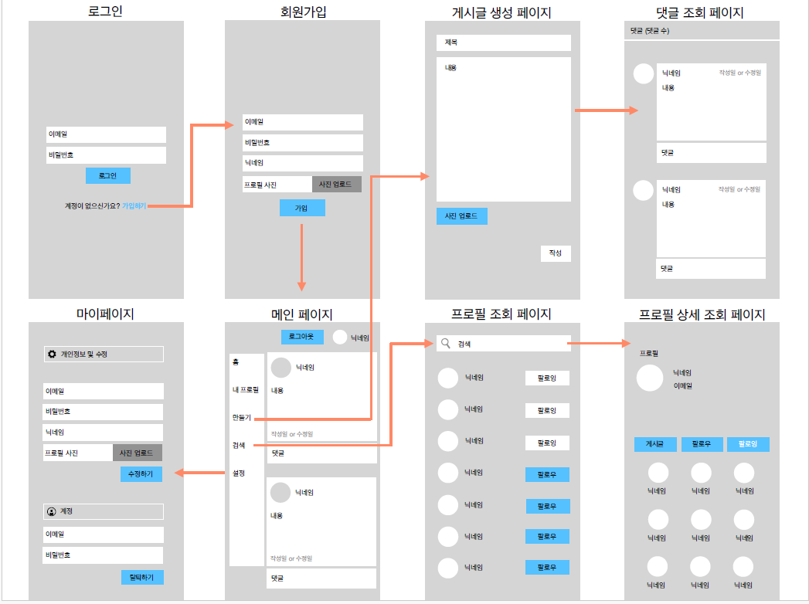
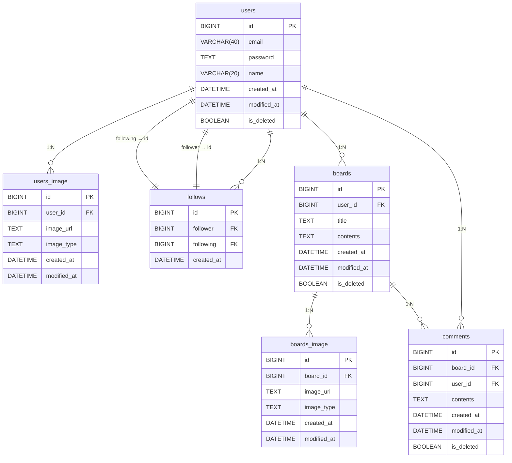

# 20조 - 뉴스피드 프로젝트

## 목차

팀 소개

역할분담

일정

프로젝트

소개

기능

주요 요구사항

ERD

API

SQL

## 팀 소개

| 이름  | 구성 |
|-----|----|
| 전 탁 | 팀장 |
| 고대현 | 팀원 |
| 문유빈 | 팀원 |
| 윤예진 | 팀원 |
| 김수환 | 팀원 |

### 역할 분담

| 이름  | 담당 기능                                          |
|-----|------------------------------------------------|
| 문유빈 | 엔티티 설계                                         |
| 고대현 | 로그인/로그아웃 구현                                    |
| 전 탁 | 유저 CRUD, 유저 이미지, 게시글 이미지, 팔로우 구현<br>전체 연관관계 도움 |
| 윤예진 | 게시글 CRUD                                       |
| 김수환 | 댓글 CRUD                                        |

### 일정

| 날짜                | 작업 내용                                               |
|-------------------|----------------------------------------------------|
| 2025년 2월 14일  | S.A 작성 및 와이어 프레임 설계, API 설계, ERD 작성, 엔티티 설계 |
| 2025년 2월 17일  | 각자 맡은 엔티티에 대한 기본적인 CRUD 기능 구현           |
| 2025년 2월 18일  | 각 엔티티 간 연관 관계 구현                           |
| 2025년 2월 19일  | 코드 수정 및 README.md 작성, 발표 자료 준비 및 영상 제작  |

## 프로젝트

**인스파그램**

### 소개

인스타그램, 쓰레드를 참조하여 뉴스피드를 구현해보는 프로젝트 입니다.

### 기능

- 로그인 구현
- 유저 간 팔로워, 팔로잉 기능 구현
- 게시물과 유저의 이미지 기능 구현
- 댓글 구현

### 주요 요구사항

[REQUIREMENT.md](REQUIREMENT.md)

### 와이어 프레임



### ERD



--- 

### API

**Postman 사용하여 테스트**
[Postman API](https://app.getpostman.com/join-team?invite_code=583b807abe8f31406ad9d0194e5b8a56d21b1bf45dcb7d3fdfd659cfffdc19af&target_code=d253d2a2a39d44ff1b64bd4787363d74)
**인증**

| 기능                  | HTTP Method          | URL           | Parameters | Request Body                                                                                   | Response                                                                     | HTTP Status        |
|---------------------|----------------------|---------------|------------|------------------------------------------------------------------------------------------------|------------------------------------------------------------------------------|--------------------|
| 로그인                 | POST                 | /api/v1/login | NONE       | `{ "email": string, "password": string }`                                                      | `{ "token": string , "expireTime": string }`                                 | `200 OK`           |
| 로그인 실패 (이메일 없음)     | POST                 | /api/v1/login | NONE       | 존재하지 않는 이메일 입력                                                                                 | `{ "code": 401, "message": "해당 이메일을 찾을 수 없습니다.", "status": "UNAUTHORIZED" }` | `401 Unauthorized` |
| 로그인 실패 (이미 로그인)     | POST                 | /api/v1/login | NONE       | 이미 로그인한 상태                                                                                     | `{ "code": 401, "message": "이미 로그인한 상태 입니다.", "status": "UNAUTHORIZED" }`    | `401 Unauthorized` |
| 로그인 실패 (비밀번호 불일치)   | POST                 | /api/v1/login | NONE       | 비밀번호가 일치하지 않을 경우                                                                               | `{ "code": 401, "message": "비밀번호가 일치하지 않습니다.", "status": "UNAUTHORIZED" }`   | `401 Unauthorized` |
| 로그인 실패 (Validation) | POST                 | /api/v1/login | NONE       | 1. 이메일 길이 40자 초과<br>2. 이메일 형식 오류<br>3. 비밀번호 길이 오류 (8~20자)<br>4. 비밀번호 형식 오류 (특수문자, 대소문자, 숫자 포함) | `{ "code": 400, "message": "각 에러에 맞는 메시지", "status": "BAD_REQUEST" }`        | `400 Bad Request`  |
| 토큰 검증 실패            | 모든 요청 (로그인, 회원가입 제외) | 모든 URL        | NONE       | 토큰이 없거나 비어있거나 값이 이상한 경우                                                                        | `{ "code": 401, "message": "토큰 오류에 맞는 메시지.", "status": "UNAUTHORIZED" }`     | `401 Unauthorized` |

**유저**

| 기능                    | HTTP Method | URL                               | Parameters         | Request Body                                                                                   | Response                                                                                                                                                                             | HTTP Status       |
|-----------------------|-------------|-----------------------------------|--------------------|------------------------------------------------------------------------------------------------|--------------------------------------------------------------------------------------------------------------------------------------------------------------------------------------|-------------------|
| 유저 생성 (등록)            | POST        | /api/v1/users/register            | NONE               | `{ "email": string, "password": string, "name": string, "image": string }`                     | `{ "id": long, "email": string, "name": string, "images": List<String>, "createdAt": LocalDateTime, "modifiedAt": LocalDateTime }`                                                   | `201 Created`     |
| 유저 생성 실패              | POST        | /api/v1/users/register            | NONE               | 이미 존재하는 이메일인 경우                                                                                | `{ "code": 400, "message": "이미 존재하는 이메일입니다.", "status": "BAD_REQUEST" }`                                                                                                             | `400 Bad Request` |
| 유저 생성 실패 (Validation) | POST        | /api/v1/users/register            | NONE               | 1. 이메일 형식 오류 (40자 초과 포함)<br>2. 비밀번호 형식 오류 (특수문자, 대소문자, 숫자 포함, 8~20자 범위)<br>3. 이름이 비어있거나 공백일 경우 | `{ "code": 400, "message": "각 에러에 맞는 메시지", "status": "BAD_REQUEST" }`                                                                                                                | `400 Bad Request` |
| 전체 유저 조회              | GET         | /api/v1/users                     | NONE               | NONE                                                                                           | `[ { "id": long, "email": string, "name": string, "image": String, "follower_count": Long, "createdAt": LocalDateTime, "modifiedAt": LocalDateTime } ... ]`                          | `200 OK`          |
| 단건 유저 조회              | GET         | /api/v1/users/{id}                | `Path - id : long` | NONE                                                                                           | `{ "id": long, "email": string, "name": string, "image": List<String>, "followings": List<UserInfoResponseDto>, "createdAt": LocalDateTime, "modifiedAt": LocalDateTime }`           | `200 OK`          |
| 단건 유저 조회 실패           | GET         | /api/v1/users/{id}                | `Path - id : long` | id에 해당하는 유저가 존재하지 않을 경우                                                                        | `{ "code": 404, "message": "해당 유저가 존재하지 않습니다.", "status": "NOT_FOUND" }`                                                                                                             | `404 Not Found`   |
| 유저 팔로우 (추가/취소)        | POST        | /api/v1/users/me/{id}             | `Path - id : long` | NONE                                                                                           | `{ "id": long, "email": string, "name": string, "image": List<ImageResponseDto>, "followings": List<UserInfoResponseDto>, "createdAt": LocalDateTime, "modifiedAt": LocalDateTime }` | `200 OK`          |
| 유저 팔로우 실패             | POST        | /api/v1/users/me/{id}             | `Path - id : long` | 토큰에 해당하는 유저 또는 팔로우 대상이 존재하지 않을 경우                                                              | `{ "code": 404, "message": "해당 유저가 존재하지 않습니다.", "status": "NOT_FOUND" }`                                                                                                             | `404 Not Found`   |
| 유저 수정                 | PUT         | /api/v1/users/me                  | NONE               | 1. 비밀번호 형식 오류 (특수문자, 대소문자, 숫자 포함, 8~20자 범위)<br>2. 이름이 비어있거나 공백일 경우                             | `{ "code": 400, "message": "각 에러에 맞는 메시지", "status": "BAD_REQUEST" }`                                                                                                                | `200 OK`          |
| 유저 수정 실패              | PUT         | /api/v1/users/me                  | NONE               | `{ "name": string, "image": string }`                                                          | `{ "id": long, "email": string, "name": string, "images": List<String>, "createdAt": LocalDateTime, "modifiedAt": LocalDateTime }`                                                   | `200 OK`          |
| 이미지 추가                | PUT         | /api/v1/users/me/addImage         | NONE               | `{ "image": string }`                                                                          | `{ "id": long, "email": string, "name": string, "images": List<String>, "createdAt": LocalDateTime, "modifiedAt": LocalDateTime }`                                                   | `200 OK`          |
| 이미지 추가 실패             | PUT         | /api/v1/users/me/addImage         | NONE               | 토큰에 해당하는 유저가 존재하지 않을 경우                                                                        | `{ "code": 404, "message": "해당 유저가 존재하지 않습니다.", "status": "NOT_FOUND" }`                                                                                                             | `404 Not Found`   |
| 이미지 삭제                | PUT         | /api/v1/users/me/deleteImage/{id} | `Path - id : long` | NONE                                                                                           | `{ "id": long, "email": string, "name": string, "images": List<String>, "createdAt": LocalDateTime, "modifiedAt": LocalDateTime }`                                                   | `200 OK`          |
| 이미지 삭제 실패             | PUT         | /api/v1/users/me/deleteImage/{id} | `Path - id : long` | 1. 토큰에 해당하는 유저가 존재하지 않을 경우<br>2. id에 해당하는 이미지가 존재하지 않을 경우                                      | `{ "code": 404, "message": "각 에러에 맞는 메시지", "status": "NOT_FOUND" }`                                                                                                                  | `404 Not Found`   |
| 유저 삭제                 | PATCH       | /api/v1/users/me                  | NONE               | NONE                                                                                           | NONE                                                                                                                                                                                 | `200 OK`          |
| 유저 삭제 실패              | PATCH       | /api/v1/users/me                  | NONE               | 토큰에 해당하는 유저가 존재하지 않을 경우                                                                        | `{ "code": 404, "message": "해당 유저가 존재하지 않습니다.", "status": "NOT_FOUND" }`                                                                                                             | `404 Not Found`   |

**게시글**

| 기능                     | HTTP Method | URL                 | Parameters                                                 | Request Body                                                               | Response                                                                                                                                                                                                                                | HTTP Status       |
|------------------------|-------------|---------------------|------------------------------------------------------------|----------------------------------------------------------------------------|-----------------------------------------------------------------------------------------------------------------------------------------------------------------------------------------------------------------------------------------|-------------------|
| 게시물 생성                 | POST        | /api/v1/boards      | NONE                                                       | `{ "title": string, "contents": string, "image": string }`                 | `{ "id": long, "userId": long, "title": string, "contents": string, "images": String, "createdAt": LocalDateTime, "modifiedAt": LocalDateTime }`                                                                                        | `201 Created`     |
| 게시물 생성 실패 (Validation) | POST        | /api/v1/boards      | NONE                                                       | 1. 제목이 20자 이상이거나, 비어있을 경우<br>2. 내용이 200자 이상이거나, 비어있을 경우<br>3. 이미지가 비어있을 경우 | `{ "code": 400, "message": "각 에러에 맞는 메시지.", "status": "BAD_REQUEST" }`                                                                                                                                                                  | `400 Bad Request` |
| 게시물 단건 조회              | GET         | /api/v1/boards/{id} | `Path - id : long`                                         | NONE                                                                       | `{ "id": long, "userId": long, "title": string, "contents": string, "images": String, "comments": [{ "id": Long, "userId": Long, "content": string }], "createdAt": LocalDateTime, "modifiedAt": LocalDateTime, "commentCount": long }` | `200 OK`          |
| 게시물 단건 조회 실패           | GET         | /api/v1/boards/{id} | `Path - id : long`                                         | 해당 게시물이 존재하지 않을 경우                                                         | `{ "code": 404, "message": "해당 게시물이 존재하지 않습니다.", "status": "NOT_FOUND" }`                                                                                                                                                               | `404 Not Found`   |
| 게시물 수정                 | PUT         | /api/v1/boards/{id} | `Path - id : long, HttpServletRequest - Login User : long` | `{ "title": string, "contents": string, "image": List<String> }`           | `{ "id": long, "userId": long, "title": string, "contents": string, "image": String, "createdAt": LocalDateTime, "modifiedAt": LocalDateTime }`                                                                                         | `200 OK`          |
| 게시물 수정 실패              | PUT         | /api/v1/boards/{id} | `Path - id : long, HttpServletRequest - Login User : long` | 1. 제목이 20자 이상이거나, 비어있을 경우<br>2. 내용이 200자 이상이거나, 비어있을 경우<br>3. 이미지가 비어있을 경우 | `{ "code": 400, "message": "각 에러에 맞는 메시지.", "status": "BAD_REQUEST" }`                                                                                                                                                                  | `400 Bad Request` |
| 게시물 삭제                 | DELETE      | /api/v1/boards/{id} | `Path - id : long, HttpServletRequest - Login User : long` | NONE                                                                       | NONE                                                                                                                                                                                                                                    | `200 OK`          |
| 게시물 삭제 실패              | DELETE      | /api/v1/boards/{id} | `Path - id : long, HttpServletRequest - Login User : long` | 해당 게시물이 존재하지 않을 경우                                                         | `{ "code": 404, "message": "해당 게시물이 존재하지 않습니다.", "status": "NOT_FOUND" }`                                                                                                                                                               | `404 Not Found`   |
| 게시물 페이지 조회             | GET         | /api/v1/boards/page | `(선택) Query - page : long, size : long`                    | NONE                                                                       | `Page 형태의 { "id": long, "userName": string, "title": string, "contents": string, "commentCount": long, "images": string, "createdAt": LocalDateTime, "modifiedAt": LocalDateTime }`                                                     | `200 OK`          |

**댓글**

| 기능                    | HTTP Method | URL                                    | Parameters                                                          | Request Body                                             | Response                                                                                                                             | HTTP Status        |
|-----------------------|-------------|----------------------------------------|---------------------------------------------------------------------|----------------------------------------------------------|--------------------------------------------------------------------------------------------------------------------------------------|--------------------|
| 댓글 생성 (등록)            | POST        | /api/v1/boards/{boardId}/comments      | `Path - boardId : long`<br>`HttpServletRequest - Login User : long` | `{ "contents": string }`                                 | `{ "id": long, "userId": long, "boardId": long, "content": string, "createAt": LocalDateTime, "modifiedAt": LocalDateTime }`         | `201 Created`      |
| 댓글 생성 실패              | POST        | /api/v1/boards/{boardId}/comments      | `Path - boardId : long`<br>`HttpServletRequest - Login User : long` | 토큰에 해당하는 유저가 존재하지 않거나, `boardId`에 해당하는 게시물이 존재하지 않을 경우   | `{ "code": 404, "message": "각 에러에 맞는 메시지.", "status": "NOT_FOUND" }`                                                                 | `404 Not Found`    |
| 댓글 생성 실패 (Validation) | POST        | /api/v1/boards/{boardId}/comments      | `Path - boardId : long`<br>`HttpServletRequest - Login User : long` | 내용이 200자를 넘거나, 비어 있을 경우                                  | `{ "code": 400, "message": "각 에러에 맞는 메시지.", "status": "BAD_REQUEST" }`                                                               | `400 Bad Request`  |
| 댓글 단건 조회 (특정 게시물)     | GET         | /api/v1/boards/{boardId}/comments/{id} | `Path - boardId : long`<br>`Path - id : long`                       | NONE                                                     | `{ "id": long, "userId": long, "boardId": long, "content": string, "createAt": LocalDateTime, "modifiedAt": LocalDateTime }`         | `200 OK`           |
| 댓글 단건 조회 실패           | GET         | /api/v1/boards/{boardId}/comments/{id} | `Path - boardId : long`<br>`Path - id : long`                       | `boardId`에 해당하는 게시물이 존재하지 않거나, `id`에 해당하는 댓글이 존재하지 않는 경우 | `{ "code": 404, "message": "각 에러에 맞는 메시지.", "status": "NOT_FOUND" }`                                                                 | `404 Not Found`    |
| 댓글 전체 조회 (특정 게시물)     | GET         | /api/v1/boards/{boardId}/comments      | `Path - boardId : long`                                             | NONE                                                     | `[ { "id": long, "userId": long, "boardId": long, "content": string, "createAt": LocalDateTime, "modifiedAt": LocalDateTime } ... ]` | `200 OK`           |
| 댓글 전체 조회 실패           | GET         | /api/v1/boards/{boardId}/comments      | `Path - boardId : long`                                             | `boardId`에 해당하는 게시물이 존재하지 않을 경우                          | `{ "code": 404, "message": "각 에러에 맞는 메시지.", "status": "NOT_FOUND" }`                                                                 | `404 Not Found`    |
| 댓글 수정                 | PATCH       | /api/v1/comments/{id}                  | `Path - id : long`<br>`HttpServletRequest - Login User : long`      | `{ "contents": string }`                                 | `{ "id": long, "userId": long, "boardId": long, "content": string, "createAt": LocalDateTime, "modifiedAt": LocalDateTime }`         | `200 OK`           |
| 댓글 수정 실패              | PATCH       | /api/v1/comments/{id}                  | `Path - id : long`<br>`HttpServletRequest - Login User : long`      | `id`에 해당하는 댓글이 존재하지 않을 경우                                | `{ "code": 404, "message": "각 에러에 맞는 메시지.", "status": "NOT_FOUND" }`                                                                 | `404 Not Found`    |
| 댓글 수정 실패 (권한 없음)      | PATCH       | /api/v1/comments/{id}                  | `Path - id : long`<br>`HttpServletRequest - Login User : long`      | 토큰을 통해 들어온 유저와 댓글 작성자가 다를 경우                             | `{ "code": 401, "message": "토큰 오류에 맞는 메시지.", "status": "UNAUTHORIZED" }`                                                             | `401 Unauthorized` |
| 댓글 수정 실패 (Validation) | PATCH       | /api/v1/comments/{id}                  | `Path - id : long`<br>`HttpServletRequest - Login User : long`      | 내용이 200자를 넘거나, 비어 있을 경우                                  | `{ "code": 400, "message": "각 에러에 맞는 메시지.", "status": "BAD_REQUEST" }`                                                               | `400 Bad Request`  |
| 댓글 삭제                 | DELETE      | /api/v1/comments/{id}                  | `Path - id : long`<br>`HttpServletRequest - Login User : long`      | NONE                                                     | NONE                                                                                                                                 | `200 OK`           |
| 댓글 삭제 실패 (권한 없음)      | DELETE      | /api/v1/comments/{id}                  | `Path - id : long`<br>`HttpServletRequest - Login User : long`      | 토큰을 통해 들어온 유저와 댓글 작성자가 다를 경우                             | `{ "code": 401, "message": "토큰 오류에 맞는 메시지.", "status": "UNAUTHORIZED" }`                                                             | `401 Unauthorized` |
| 댓글 삭제 실패              | DELETE      | /api/v1/comments/{id}                  | `Path - id : long`<br>`HttpServletRequest - Login User : long`      | `id`에 해당하는 댓글이 존재하지 않을 경우                                | `{ "code": 404, "message": "각 에러에 맞는 메시지.", "status": "NOT_FOUND" }`                                                                 | `404 Not Found`    |

--- 

### SQL

```sql
CREATE TABLE users
(
    id          BIGINT AUTO_INCREMENT PRIMARY KEY,
    email       VARCHAR(40) NOT NULL,
    password    TEXT        NOT NULL,
    name        VARCHAR(20) NOT NULL,
    created_at  DATETIME    NOT NULL,
    modified_at DATETIME    NOT NULL,
    is_deleted  BOOLEAN     NOT NULL
);

CREATE TABLE users_image
(
    id          BIGINT AUTO_INCREMENT PRIMARY KEY,
    user_id     BIGINT   NOT NULL,
    image_url   TEXT     NOT NULL,
    image_type  TEXT     NOT NULL,
    created_at  DATETIME NOT NULL,
    modified_at DATETIME NOT NULL,
    CONSTRAINT fk_image_user FOREIGN KEY (user_id) REFERENCES users (id)
);

CREATE TABLE follows
(
    id         BIGINT AUTO_INCREMENT PRIMARY KEY,
    follower   BIGINT   NOT NULL,
    following  BIGINT   NOT NULL,
    created_at DATETIME NOT NULL,
    CONSTRAINT fk_follower FOREIGN KEY (follower) REFERENCES users (id),
    CONSTRAINT fk_following FOREIGN KEY (following) REFERENCES users (id)
);

CREATE TABLE boards
(
    id          BIGINT AUTO_INCREMENT PRIMARY KEY,
    user_id     BIGINT   NOT NULL,
    title       TEXT     NOT NULL,
    contents    TEXT     NOT NULL,
    created_at  DATETIME NOT NULL,
    modified_at DATETIME NOT NULL,
    is_deleted  BOOLEAN  NOT NULL,
    CONSTRAINT fk_user FOREIGN KEY (user_id) REFERENCES users (id)
);

CREATE TABLE boards_image
(
    id          BIGINT AUTO_INCREMENT PRIMARY KEY,
    board_id    BIGINT   NOT NULL,
    image_url   TEXT     NOT NULL,
    image_type  TEXT     NOT NULL,
    created_at  DATETIME NOT NULL,
    modified_at DATETIME NOT NULL,
    CONSTRAINT fk_image_board FOREIGN KEY (board_id) REFERENCES boards (id)
);

CREATE TABLE comments
(
    id          BIGINT AUTO_INCREMENT PRIMARY KEY,
    board_id    BIGINT   NOT NULL,
    user_id     BIGINT   NOT NULL,
    contents    TEXT     NOT NULL,
    created_at  DATETIME NOT NULL,
    modified_at DATETIME NOT NULL,
    is_deleted  BOOLEAN  NOT NULL,
    CONSTRAINT fk_comments_board FOREIGN KEY (board_id) REFERENCES boards (id),
    CONSTRAINT fk_comments_user FOREIGN KEY (user_id) REFERENCES users (id)
);
```
