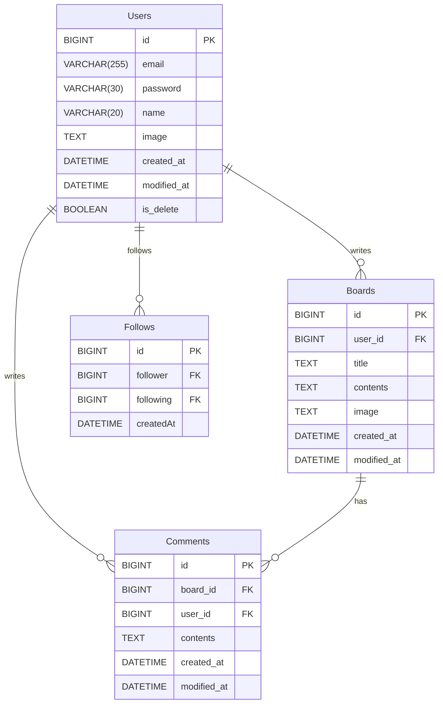

# 20조 - 뉴스피드 프로젝트

## 목차

### 팀 소개

#### 역할분담

### 프로젝트

#### 소개

#### 주요 요구사항

#### ERD

#### API

#### SQL

### 팀 소개

#### 역할분담

### 프로젝트

**인스파그램**

#### 소개

인스타그램, 쓰레드를 참조하여 뉴스피드를 구현해보는 프로젝트 입니다.

#### 주요 요구사항

#### ERD

#### API

**인증**

|  기능  | HTTP Method |       URL        | Parameters | Request Body                              | Response                                           | HTTP Status |
|:----:|-------------|:----------------:|------------|-------------------------------------------|:---------------------------------------------------|-------------|
| 로그인  | **POST**    | `/api/v1/login`  | NONE       | { "email" : string, "password" : string } | { "id" : long, "email" : string, "name" : string } | `200 OK`    |
| 로그아웃 | **POST**    | `/api/v1/logout` | NONE       | NONE                                      | "로그아웃 되었습니다"                                       | `200 OK`    |

**유저**

|        기능        | HTTP Method     |          URL           | Parameters                                       | Request Body                                                                 | Response                                                                                                                                        | HTTP Status |
|:----------------:|-----------------|:----------------------:|--------------------------------------------------|------------------------------------------------------------------------------|:------------------------------------------------------------------------------------------------------------------------------------------------|-------------|
|    유저 생성(등록)     | **POST**        |    `/api/v1/users`     | NONE                                             | { "email" : string, "password" : string }                                    | { “id” : long, “email” : string, “password” : string, “name” : string, “image” : string, “createdAt” : string, “modifiedAt” : string }          | `200 OK`    |
|     전체 유저 조회     | **GET**         |    `/api/v1/users`     | NONE                                             | NONE                                                                         | [ { “id” : long, “email” : string, “name” : string, “image” : string, “follower_count” : int, “createdAt” : string, “modifiedAt” : string } … ] | `200 OK`    |
|     단건 유저 조회     | **GET**         |  `/api/v1/users/{id}`  | Path - id : long                                 | NONE                                                                         | { “id” : long, “email” : string, “name” : string, “image” : string, “followings” : List<User>, “createdAt” : string, “modifiedAt” : string }    | `200 OK`    |
| 유저 팔로우(추가 or 취소) | **PUT??POST??** | ``/api/v1/users/{id}`` | Path - id : long Session - login_user : long | NONE                                                                         | { “id” : long, “email” : string, “name” : string, “image” : string, “followings” : List<User>, “createdAt” : string, “modifiedAt” : string }    | `200 OK`    |
|      유저 수정       | **PUT**         |   `/api/v1/users/me`   | Session - login_user : long                      | { "email" : string, "password" : string, "name" : string, "image" : string } | { “id” : long, “email” : string, “name” : string, “image” : string, “createdAt” : string, “updateAt” : string }                                 | `200 OK`    |
|      유저 삭제       | **PATCH**       |   `/api/v1/users/me`   | Session - login_user : long                      | NONE                                                                         | NONE                                                                                                                                            | `200 OK`    |

**게시글**

|     기능     | HTTP Method |           URL           | Parameters                                       | Request Body                                                 | Response                                                                                                                                                                                       | HTTP Status |
|:----------:|-------------|:-----------------------:|--------------------------------------------------|--------------------------------------------------------------|:-----------------------------------------------------------------------------------------------------------------------------------------------------------------------------------------------|-------------|
| 게시글 생성(등록) | **POST**    |    `/api/v1/boards`     | NONE                                             | { "title" : string, "contents" : string, "images" : string } | { “id” : long, “title” : string, “contents” : string, “image” : string, “commentCount” : int, “createdAt” : string, “modifiedAt” : string }                                                    | `200 OK`    |
| 전체 게시글 조회  | **GET**     |    `/api/v1/boards`     | NONE                                             | NONE                                                         | [ { “id” : long, “title” : string, “contents” : string, “image” : string, "user_name" : string, "user_image" : string, “commentCount” : int, “createdAt” : string, “modifiedAt” : string } … ] | `200 OK`    |
|   게시글 수정   | **PUT**     |  `/api/v1/boards/{id}`  | Path - id : long Session - login_user : long | { "title" : string, "contents" : string, "images" : string } | { “id” : long, “title” : string, “contents” : string, “image” : string, “commentCount” : int, “createdAt” : string, “modifiedAt” : string }                                                    | `200 OK`    |
|   게시글 삭제   | **DELETE**  | ``/api/v1/boards/{id}`` | Path - id : long Session - login_user : long | NONE                                                         | NONE                                                                                                                                                                                           | `200 OK`    |

**댓글**

|        기능        | HTTP Method |                 URL                 | Parameters                                            | Request Body            | Response                                                                                                                                    | HTTP Status |
|:----------------:|-------------|:-----------------------------------:|-------------------------------------------------------|-------------------------|:--------------------------------------------------------------------------------------------------------------------------------------------|-------------|
|    댓글 생성(등록)     | **POST**    | `/api/v1/boards/{boardId}/comments` | Path - boardId : long Session - login_user : long | { "contents" : string } | { “id” : long, “userId” : long, "name" : string, “boardId” : long, “contents” : string, “createdAt” : string, “modifiedAt” : string }       | `200 OK`    |
| 댓글(특정 게시물) 전체 조회 | **GET**     | `/api/v1/boards/{boardId}/comments` | Path - id : long                                      | NONE                    | [ { “id” : long, “userId” : long, "name" : string, “boardId” : long, “contents” : string, “createdAt” : string, “modifiedAt” : string } … ] | `200 OK`    |
|      댓글 수정       | **PUT**     |       `/api/v1/comments/{id}`       | Path - id : long Session - login_user : long      | { "contents" : string } | { “id” : long, “userId” : long, "name" : string, “boardId” : long, “contents” : string, “createdAt” : string, “modifiedAt” : string }       | `200 OK`    |
|      댓글 삭제       | **DELETE**  |      ``/api/v1/comments/{id}``      | Path - id : long Session - login_user : long      | NONE                    | NONE                                                                                                                                        | `200 OK`    |

#### SQL
